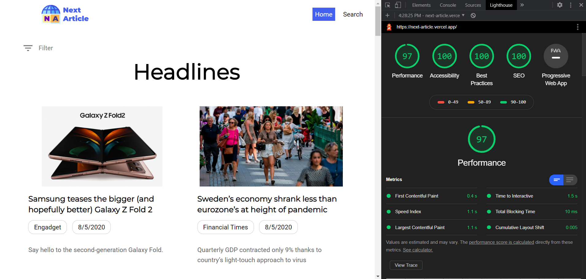
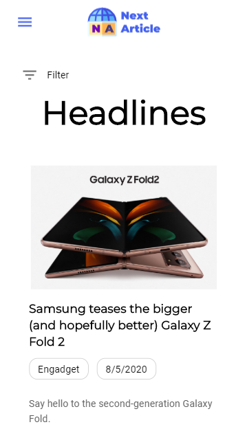
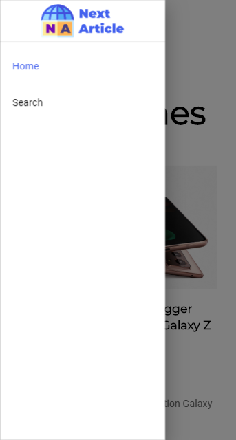
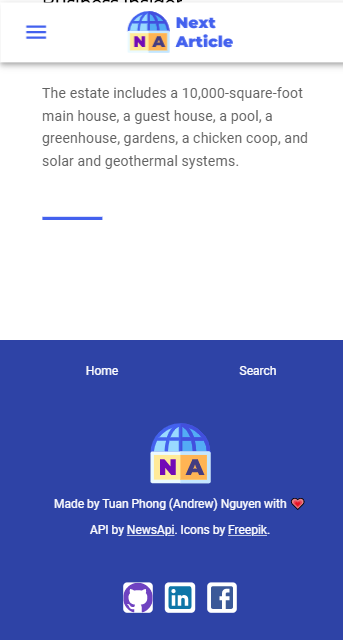
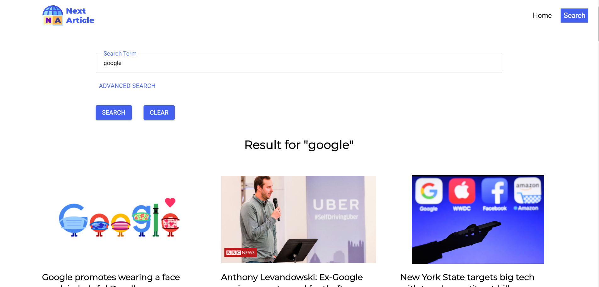
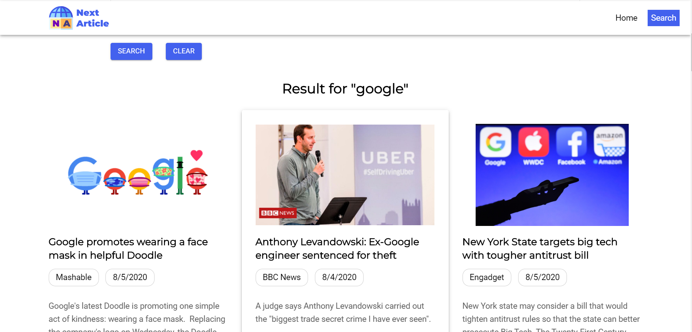
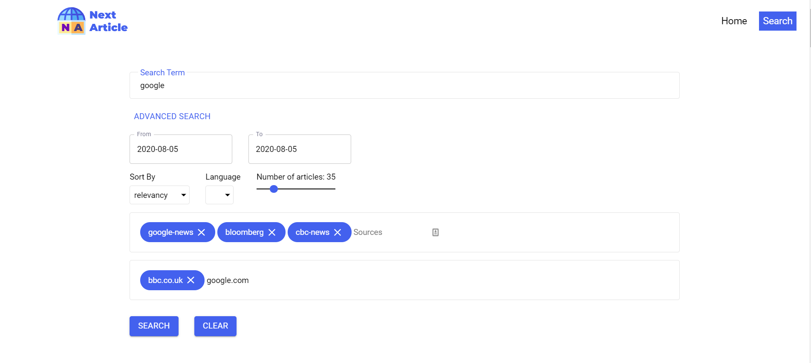

Live Demo: https://next-article.vercel.app/

## Built with

- **Framework:** Next.js
- **Styling:** Material-UI, styled-components, framer-motion
- **Type-checking:** TypeScript

## My major discoveries

- Next.js

  It is easy to learn new things, but updating your knowledge is a different story. Next.js introduces lots of new concepts, and there were not many up to date tutorials out there. Learning Next.js was the first time that I learned a new stack purely through reading documents and searching forums. 

  Even then, I was struggling to wrap my head around redux state management with a server store. I kept questioning myself if it is worth going through all this trouble when I could stick with just React. But I had encountered these thoughts numerous times before, when I first learned React, or when I tried Redux. Eventually, I mastered the framework.

  - Server-side rendering
  - (Blazing fast) Static site generation
  - Next.js routing, dynamic paths
  - Next.js x Redux

- Web vitals

  - Lighthouse, PageSpeed Insights
  - Largest Contentful Paint (LCP), First Input Delay (FID), Cumulative Layout Shift (CLS), First Contentful Paint (FCP), Total Blocking Time (TTB)

- Accessibility

  - Color contrast
  - Component's spacing on mobile 
  - Heading orders
  - `aria-label` for icons

- SEO

  - `meta` tag and `og` tags

  

## Features

- Server side rendering news for better SEO
- Filtering news with beautiful inputs (text, tag, range, select, etc.)

## Short Demo (YouTube)

## Gallery

### Mobile shots

### Desktop shots

